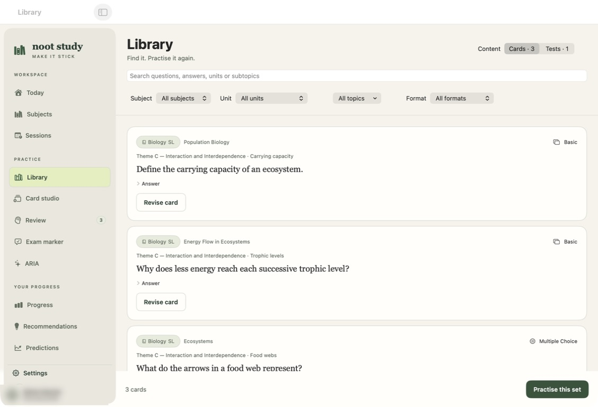
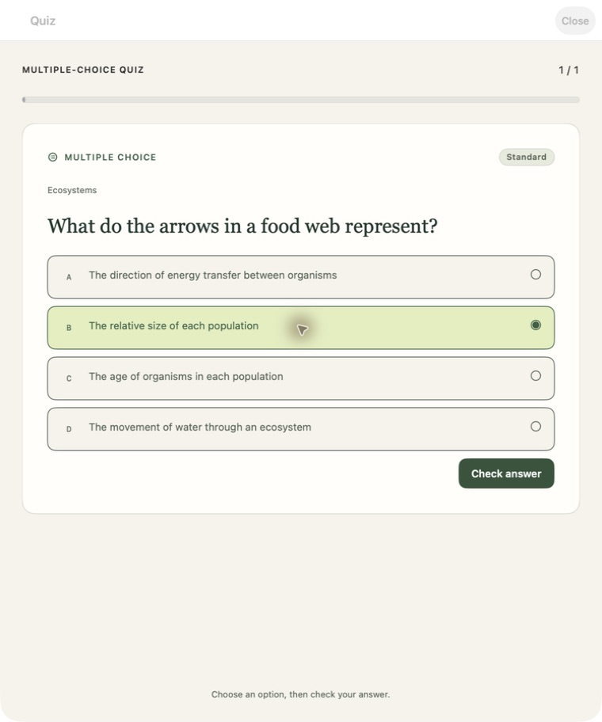
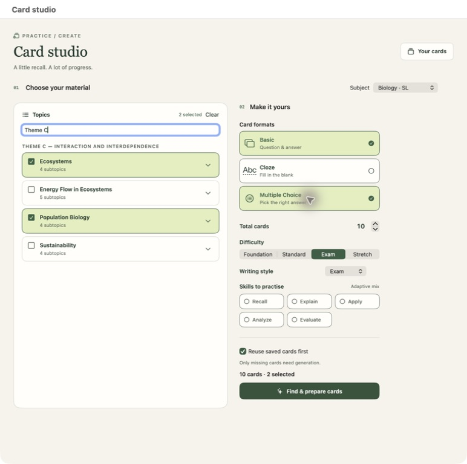

# Noot Study 2.0

**A native Mac workspace for studying, practising, and finding what you already know.**

Noot Study brings flashcards, multiple-choice quizzes, practice exams, spaced review, and IB progress into one SwiftUI app. ARIA connects the study material you have saved with the AI provider you choose. Your library lives locally in SwiftData.

[Release 2.0](https://github.com/leofratu/nootstudy/releases/tag/v2.0.0) · [What's new](#whats-new-in-20) · [Get started](#get-started) · [Build locally](#build-locally) · [Release notes](docs/releases/v2.0.0.md)



*Screenshots render the real native views with synthetic study material. Identity areas are blurred before capture; no personal study records, grades, credentials, or chat history are included.*

## What's new in 2.0

| Area | What changed |
| --- | --- |
| Workspace | A paper-and-ink interface, grouped sidebar, redesigned settings, clearer review status, and direct practice actions. |
| Multiple choice | Choose an answer, submit it with **Check answer**, get feedback, and finish with a score. Choices shuffle for each attempt. |
| Library | Find cards and saved tests by subject, curriculum unit, topic, and content. Filter cards by format and start practising from a result. |
| Card Studio | Select several topics or subtopics, combine card formats, and preview editable drafts before saving. |
| Reuse | Saved cards fill revision sets first. ARIA and generation receive saved questions and answers so they can return the original card when the meaning matches. |
| Daily review | One allowance across the app, with a ceiling of 40 distinct cards and support for lower personal targets. Remaining cards wait for another day. |
| Exam practice | Save tests with topic metadata, reopen questions and answers, and keep marking feedback in the Library. |
| Data continuity | Reusing or hiding a repeated card preserves its original record and review history. Existing stores remain compatible. |

## Get started

1. [Build and run locally](#build-locally) with Xcode on a Mac running **macOS 14 or later**.
2. Open Noot Study and choose your subjects. Existing installations retain their saved library and preferences.
3. Open **Library** to practise saved material, or **Card studio** to prepare a set.
4. Configure an AI provider in **Settings → AI & Memory** when you want generation, tutoring, or marking.

The 2.0 release publishes the source tag and release notes. Builds and validation run locally; no app bundle, installer, ZIP, or DMG is attached.

Saved-card practice and scheduled review work without a provider connection. Generating new material, AI marking, and ARIA responses require the selected provider to be available.

## Practise what you need

### Search the Library

Switch between **Cards** and **Tests** in the sidebar's **Library** section. Search covers questions, answers, subjects, unit names, topics, subtopics, and card curriculum references. Test search also includes saved feedback.

- Filter by subject and unit, then select one or several topics.
- Choose **Multiple Choice** as the format and press **Start quiz**.
- Use **Answer question** or **Revise card** to open a single result.
- Use **Show repeated cards** to inspect original copies hidden by duplicate filtering.

Library practice does not change FSRS scheduling or consume the scheduled-review allowance. Use **Review** when you want recall ratings to update your learning schedule.

### Take a multiple-choice quiz



Select an option, then press **Check answer**. Noot Study locks that answer, identifies the correct choice, and shows the saved answer for correction. Advance through the set to see your score. **Practise again** resets the attempt and shuffles the options.

Basic cards use answer reveal. Cloze cards conceal their deletion until you reveal it. The same recall component is used in free practice, scheduled review, and study-session cards.

### Prepare a set in Card Studio



Choose topics or subtopics across units, and pick **Basic**, **Cloze**, **Multiple Choice**, or a combination. A batch contains **1–50 cards total**, distributed across the selected topic/format combinations; the minimum increases when more combinations are selected.

**Reuse saved cards first** is on by default. If the scope and format already have enough cards, the set opens without a generation request. Otherwise, only the missing count is requested. Reused cards keep their IDs, scheduling, and review history.

Practise the prepared set immediately, or edit new drafts before saving. Change questions, answers, or choices and remove unwanted drafts. Invalid multiple-choice options, malformed cloze blanks, and detected duplicates are rejected. Failed topics are reported while successful drafts remain available.

### Keep daily review manageable

The review queue, subject screens, dashboard, reminders, and ARIA review actions share one daily allowance. It counts distinct cards reviewed since local midnight, respects your goal and study intensity, and never offers more than the **40-card ceiling**. Your actual allowance can be lower.

Once it is used, Noot Study shows **Done for today** and separates the backlog from today's work. The allowance resets at local midnight. Repeated copies are filtered from the queue without deleting their records.

## Practice exams and marking

In **Exam marker**, choose a subject, add the question and your answer, set the available marks, and optionally supply a mark scheme. Use **Unit & topics** to attach curriculum scope.

Feedback contains criterion scores, evidence from your answer, corrections, a stronger example answer, and suggested practice. Scores are checked against the available marks. Without a supplied scheme, feedback is labelled a **practice estimate**; it is not an official IB grade or a recorded school assessment.

Use **Save test to Library** to keep a question before marking. Practice exams from study sessions can also be saved. Reopen them under **Library → Tests**, continue an answer, save it, and request marking. Saved feedback remains alongside the test.

## ARIA and AI providers

ARIA uses saved study context for explanations, revision, plans, grades, and progress. Explicit requests can create or edit app records. Destructive actions require an explicit request for that change.

For revision, ARIA receives existing questions and answers with their IDs. It can match a differently worded request to an existing learning point and offer **Revise saved cards**. Generation can also return an existing ID instead of a paraphrased copy. A conservative duplicate check runs when saving. Related questions testing different calculations, contrasts, or applications remain distinct.

| Provider | Setup in Settings → AI & Memory |
| --- | --- |
| Local Codex | Use an installed, signed-in Codex CLI. The app can detect its executable or use a path you provide. |
| Google Gemini | Add a Gemini API key and select a model. |
| Junali | Add the provider key and configure its compatible endpoint and model. |

Model, reasoning effort, answer detail, and supported web-search controls are explicit in settings. Model and reasoning settings are shared by the app's AI features. The default Local Codex model ID is `gpt-5.6-sol`, with medium reasoning when no preference has been saved. Availability depends on your provider account.

Study data is stored locally, but selected context is sent to your configured provider when you use an AI feature. API keys are stored in macOS Keychain. Local Codex uses your CLI sign-in. The desktop build is **not App Sandbox enabled**, because it launches that local CLI.

## Subjects, sessions, and progress

Noot Study includes IB curriculum browsing, scoped study sessions, FSRS scheduling, proficiency tracking, grades, mastery views, achievements, and progress summaries. Sessions bring together source material, retrieval practice, corrective feedback, notes, and exam transfer.

Academic evidence and practice feedback have different roles: saved practice marking is not automatically converted into a school grade. Work completed elsewhere can be recorded as an external activity and merged into study history without double counting.

## Integrations

The [MCP connector](integrations/nootstudy-mcp/README.md) connects external tools to Noot Study's local integration bridge.

- **Local bridge:** enable it in **Settings → Integrations**. It binds to loopback, requires the app's bearer token, and exposes versioned APIs for supported study records. It is off by default.
- **MCP:** read study data and write back supported cards, reviews, sessions, plans, memories, or activities. See the connector README for setup and transports.
- **NotebookLM exchange:** export a study pack and import generated summaries or cards through the app's file workflow.

SwiftData remains the app's source of truth. Enabling an external connector does not turn the library into a cloud-sync service.

## Your data and upgrades

The app keeps the bundle identifier `com.nootstudy.ibvault.app`. Upgrades prefer the existing application-container store and preserve legacy cards and history. Replacing the `.app` bundle does not intentionally remove the study store.

Before moving to another Mac, use **Settings → Data & Backup**. Backups contain personal study data: keep them private. If a store cannot be opened, the app preserves the original and its sidecars in a recovery folder before attempting a fresh store. Keep those files together for recovery.

The repository and documentation exclude personal databases, backups, reports, credentials, and private course materials.

## Build locally

Development and release builds require a Mac. The 2.0 release uses **Xcode 26**, Swift 6, and XcodeGen. Swift package versions are pinned in `project.yml`.

```bash
git clone https://github.com/leofratu/nootstudy.git
cd nootstudy
git checkout v2.0.0
brew install xcodegen
xcodegen generate
open IBVault.xcodeproj
```

Select **IBVault** and run on **My Mac**. The project and module retain their historical `IBVault` name; the installed product is **Noot Study.app**.

Compile the Release configuration locally:

```bash
DEVELOPER_DIR=/Applications/Xcode.app/Contents/Developer \
xcodebuild build \
  -project IBVault.xcodeproj -scheme IBVault \
  -configuration Release -destination 'platform=macOS' \
  -derivedDataPath /tmp/nootstudy-build -jobs 2
```

The app is written to `/tmp/nootstudy-build/Build/Products/Release/Noot Study.app`. Version-tag pushes do not trigger a hosted release build. The existing hosted workflow remains available only by manual dispatch.

### Run tests

```bash
DEVELOPER_DIR=/Applications/Xcode.app/Contents/Developer \
xcodebuild test \
  -project IBVault.xcodeproj -scheme IBVault \
  -destination 'platform=macOS' \
  -derivedDataPath /tmp/nootstudy-tests \
  -jobs 2 -parallel-testing-enabled NO
```

Both targets treat Swift warnings as errors. Regression coverage includes generation formats, reuse, test persistence, duplicate detection, local-midnight review limits, ARIA actions, scheduling, backups, and app commands. Provider responses use fixtures and test seams; passing these tests is not a live-provider quality claim.

Documentation previews use an opt-in test harness with an in-memory demo library. Capture the preview windows with a separate screenshot tool; Noot Study does not capture the screen or request screen-recording permission.

```bash
TEST_RUNNER_NOOTSTUDY_SCREENSHOT_DIR=/tmp/nootstudy-screenshots \
DEVELOPER_DIR=/Applications/Xcode.app/Contents/Developer \
xcodebuild test -project IBVault.xcodeproj -scheme IBVault \
  -destination 'platform=macOS' -jobs 2 -parallel-testing-enabled NO \
  -only-testing:IBVaultTests/ReleaseScreenshotTests
```

The harness writes the current window title to `/tmp/nootstudy-screenshots/current-preview.txt`. After saving each screenshot, create its completion marker (`library.png.captured`, `card-studio.png.captured`, or `multiple-choice.png.captured`) in that directory to advance. Each preview waits up to three minutes. Screenshots in this README were captured externally with computer-use tooling.

### Repository map

```text
IBVault/
  ContentView.swift       Workspace navigation
  Design/                Shared typography, colour, and controls
  Engine/                Scheduling, limits, mastery, progression
  Models/                SwiftData study and profile records
  Services/              AI, library reuse, tests, backups, integrations
  Views/                 Native SwiftUI screens
IBVaultTests/            Regressions and opt-in screenshots
docs/                   Screenshots and release notes
integrations/           MCP connector
project.yml             XcodeGen source of truth
IBVault.xcodeproj/       Generated, checked-in Xcode project
```

Keep source membership and `project.yml` in sync with `xcodegen generate`. Do not commit study stores, material folders, credentials, DerivedData, or raw screenshots containing personal information.
