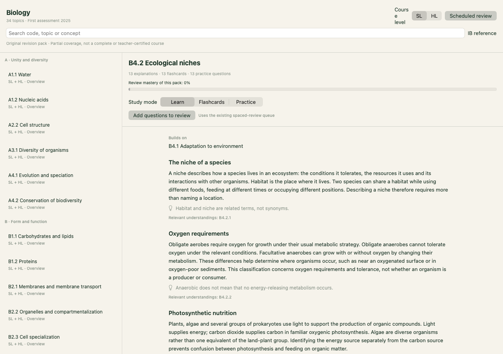
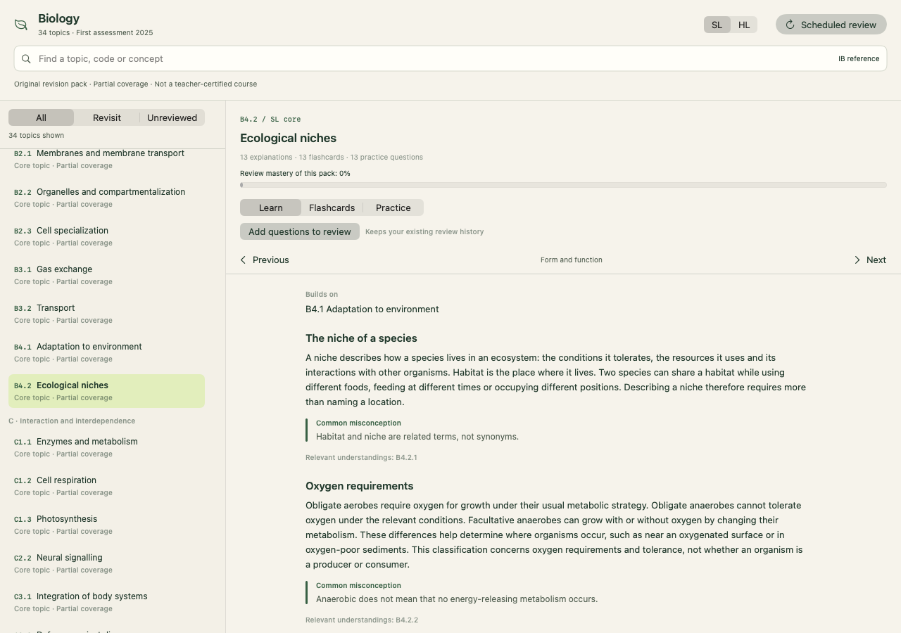
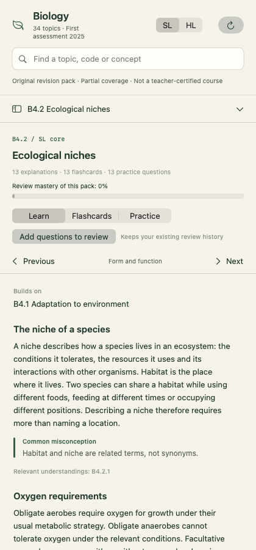
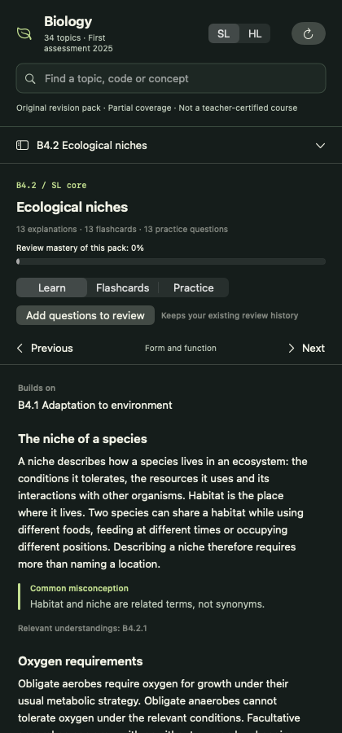
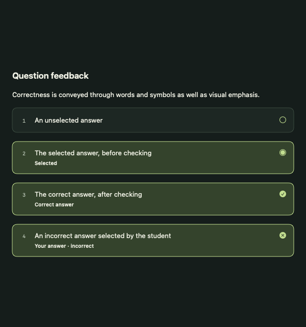
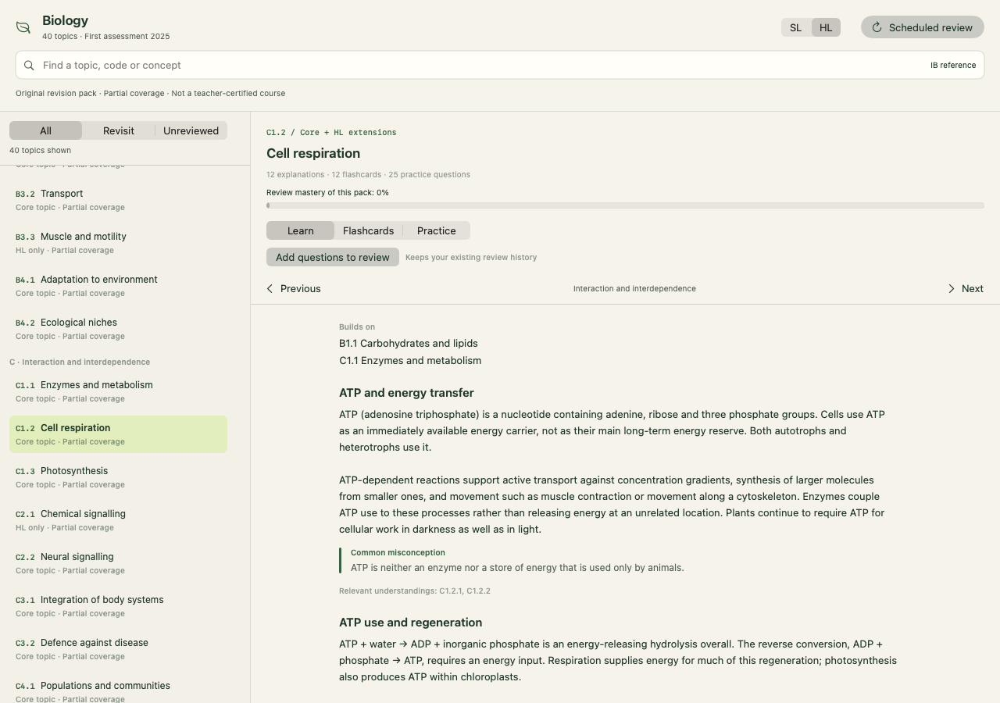

# Biology design continuation validation

Validation date: 24 September 2026.

Native evidence: https://github.com/leofratu/nootstudy/actions/runs/36008781883

Implementation commit before documentation: `bc756a8401ac885dcd2299a8200ec8042090ff0b`.

The committed application, tests, Xcode project and audit script were compared byte-for-byte with the native-tested source artifact. Documentation and CI wiring are reported separately. The full test suite was run without excluding performance tests.

| Suite | Total | Passed | Failed | Skipped |
| --- | ---: | ---: | ---: | ---: |
| Native functional and performance suite | 384 | 380 | 3 | 1 |
| Native visual suite | 2 | 2 | 0 | 0 |

**All functional regressions passed, including the 13 continuation tests. The full native suite is not green.** The skipped test is the existing opt-in screenshot fixture, not a newly disabled regression. Failures recorded in this run:

- `PerformanceBenchmarks/benchmarkEvidenceScoring()`: Expectation failed: (ms → 992.159792) < (600 → 600.0): evidence scoring 20 subjects <600ms, was 992.159792
- `PerformanceBenchmarks/benchmarkReviewQueue()`: Expectation failed: (ms → 278.38325) < (200 → 200.0): review queue should be <200ms, was 278.38325
- `ReviewQueueBulkTests/refresh2000CardsPerformance()`: Expectation failed: (ms → 254.696542) < (150 → 150.0): refresh 2000 cards should be <150ms, was 254.696542

These timing assertions also failed on unchanged main in the earlier baseline run. Their limits remain unchanged; no test was disabled, relaxed or marked as an expected failure. Runner variability and different execution order mean the measurements are not a controlled speedup claim.

Unchanged-main comparison: https://github.com/leofratu/nootstudy/actions/runs/35994816730
Isolated queue comparison, including unsuccessful experiments: https://github.com/leofratu/nootstudy/actions/runs/36005443286

The retained optimization avoids unnecessary fuzzy-signature construction and repeated scope normalization. Projected/registered-model fetch experiments were not included. Cold/warm reads, pending changes, cross-context membership, review history, SL/HL gates and mastery aliases have regression coverage.

The curriculum audit passes with 40 topic packages, 126 lesson sections, 194 questions and 123 explicit understanding references. All topic packages remain partial. Diagram coverage, some content areas, the practical programme and independent teacher review remain incomplete. Native renders do not certify VoiceOver or a complete manual keyboard/student journey.
## Screenshots and scope

Before is the functional workspace from PR #15 at `33f4874c10fcf3144cb15046d94e217a2e6b969f`, not unchanged main. Source: https://github.com/leofratu/nootstudy/actions/runs/35995407219. After images are actual SwiftUI/AppKit renders of the verified design artifact using an in-memory synthetic student fixture. No learner records or screen-capture permission changes are included.

The two visual tests render 13 fixtures: light/dark lessons at 420, 768 and 1,280 points, flashcards, practice, HL water potential, light/dark quiz feedback, SL photosynthesis and HL respiration. These are macOS window sizes, not mobile-browser or iOS-device tests. Pinned filters remain visible while the topic list scrolls; the bounded 40-topic list no longer uses lazy rows that produced blank areas during programmatic navigation.

| Before: PR #15 workspace | After: redesign |
| --- | --- |
|  |  |

| Narrow light window | Narrow dark window |
| --- | --- |
|  |  |

The isolated visual scheme and tests are included in this application publication. Ongoing visual-CI wiring is recorded separately from the byte-verified application source. The redesign scope is Biology study/navigation, not every dashboard, grade-management or AI-chat screen. PR #16 remains stacked on #15; merge order is #15 then #16, with retargeting after the base merges. Neither PR has been merged by this publication step.
